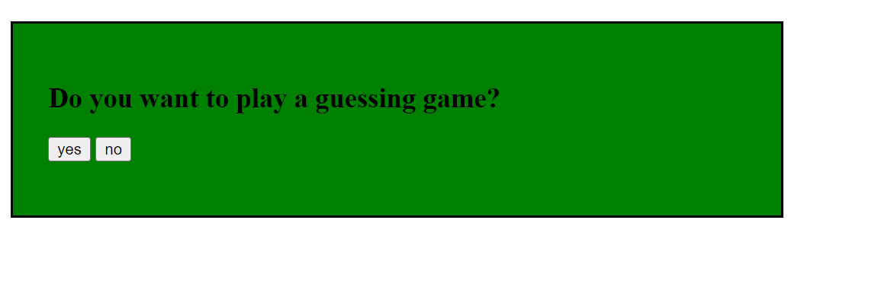
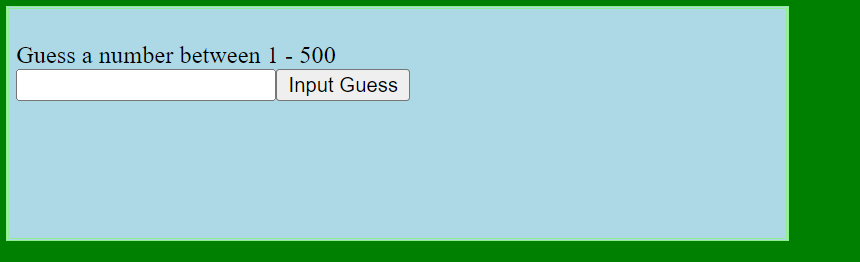
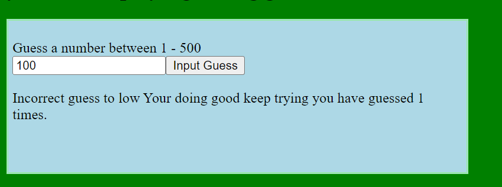
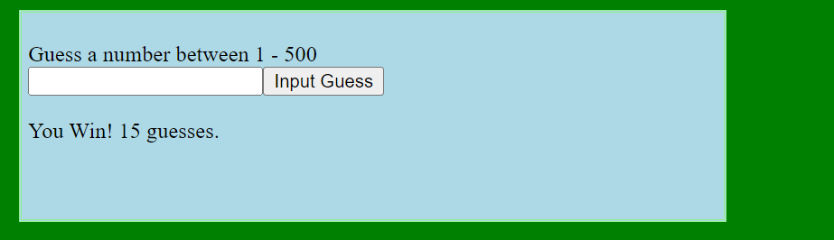
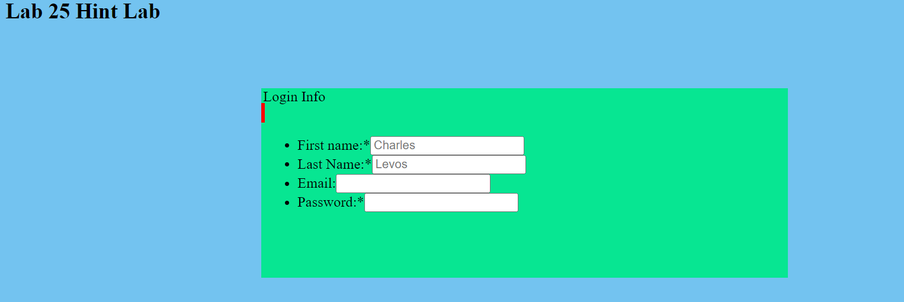
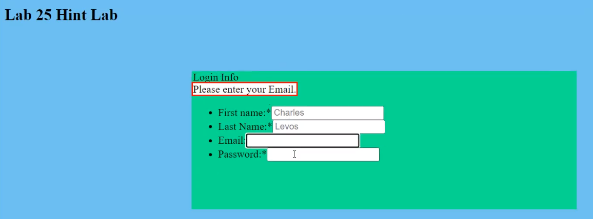

# ISC-150 Intro to Scripting/markup language
## Lab23 
Lab23 involves a series of guesses of numbers between 1 and 500. I used HTML, CSS, Javascript. HTML tags included head, body,div,p. In CSS I used different styling attributes, applied by id,such as padding, background-color, width. In javascript I defined different variables and used a random number generator after that I used if and else statements to process the users responses meaning if the user was correct it said you win and the number of guesses it took to get the right answer and if you were wrong it said your guess is to low and it told you the number of guesses you had.

## Lab25
Lab 25 is a HTML form that collects login information. There are four input fields which include first and last name, password and email.  I  access HTML elements in javascript by using different id's which are set by the programmer. These can be accessed by using the dot operator which is followed by the name of the id for a specific input field. Using the element I set the onfocus event to execute a function. The function accesses the span used to provide instructions to the user, setting its innerHTML to an appropriate instruction. I repeat this for all four input fields. I also set an onblur event for each of the four input fields. This event sets the innerHTML of the hints span to an empty string.

